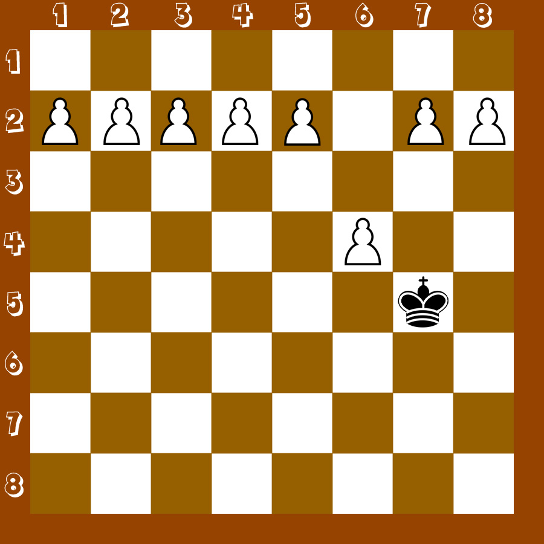

## Задание
- Написать функцию <b>pawn</b>, которая возвращает булиновое значение: <b>true</b>, если белая пешка бьёт вражескую фигуру. <b>false</b>, если не бьёт. 
- Функция принимает 4 аргумента:
    - x1: координата белой пешки по оси x.
    - y1: координата белой пешки по оси y.
    - x2: координата чёрной фигуры по оси x.
    - y2: координата чёрной фигуры по оси y.
- Задачу решить, не используя if / else, тернарный оператор, switch.

## Примеры
- (3, 6, 4, 4) => false
- (5, 3, 5, 4) => false // пешка не бьёт фигуру, которая стоит прямо перед ней
- (2, 2, 1, 3) => true
- (3, 4, 4, 4) => false // пешка не бьёт фигуру, которая стоит сзади

## Примечание
- Рабочий файл: index.js.
- Превью: 

## Справка
- Как ходят фигуры в шахматах: https://chess-boom.online/kak-hodyat-figury-v-shahmatah
